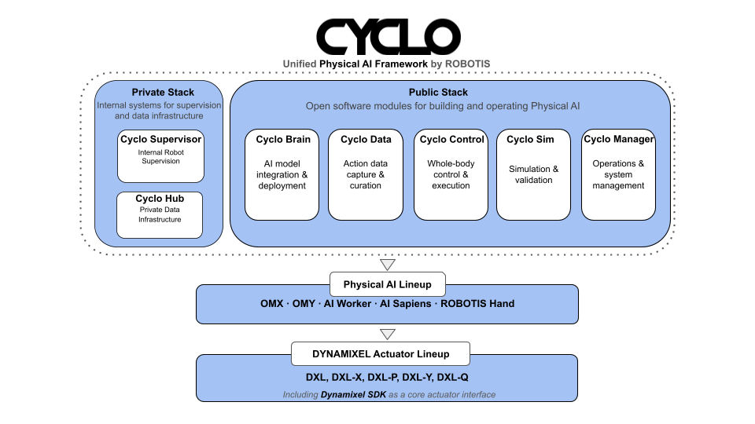

# Cyclo

<strong>Unified Physical AI framework · ROBOTIS</strong>

  
  

Cyclo is a modular framework for building and operating **Physical AI** systems. It follows ROBOTIS’s open-source philosophy: put the building blocks in the open so **Physical AI** is easier for anyone to learn, integrate, and run on real hardware—not a closed, single-vendor path. It covers AI integration, action-data workflows, robot control, simulation, and operations. Private infrastructure (supervision, proprietary data, and similar) can plug in alongside the open public stack.

**Physical AI Lineup**

- [OpenMANIPULATOR](https://github.com/ROBOTIS-GIT/open_manipulator), [AI Worker](https://github.com/ROBOTIS-GIT/ai_worker), [ROBOTIS Hand](https://github.com/ROBOTIS-GIT/robotis_hand)

**Actuator products**

- [DYNAMIXEL](https://www.dynamixel.com/) series: DXL, DXL-X, DXL-P, DXL-Y, DXL-Q — interface stack: [Dynamixel SDK](https://github.com/ROBOTIS-GIT/DynamixelSDK)

## Framework overview

  

<em>Public modules, optional private stack, Physical AI lineup, and DYNAMIXEL actuator products.</em>

## Modules & repositories

| Module | Repository | Role | Release |
|--------|------------|------|---------|
| Cyclo Manager | [`cyclo_manager`](https://github.com/ROBOTIS-GIT/cyclo_manager) | Operations and system management |  |
| Cyclo Brain | [`cyclo_brain`](https://github.com/ROBOTIS-GIT/cyclo_brain) | AI model integration and deployment |  |
| Cyclo Data | [`cyclo_data`](https://github.com/ROBOTIS-GIT/cyclo_data) | Action data capture and curation |  |
| Cyclo Control | [`cyclo_control`](https://github.com/ROBOTIS-GIT/cyclo_control) | Whole-body control and execution |  |
| Cyclo Sim | `cyclo_sim` | Simulation and validation |  |
| — | [`robotis_interfaces`](https://github.com/ROBOTIS-GIT/robotis_interfaces) | Shared interface definitions |  |
| — | [`robotis_applications`](https://github.com/ROBOTIS-GIT/robotis_applications) | Application-level integrations and third-party dependencies |  |

> Additional private or product-specific repositories may exist depending on deployment.

## Private stack

Not all components are part of the public release. Typical internal extensions:

- **Cyclo Supervisor** — robot supervision
- **Cyclo Hub** — private data infrastructure

## Quick links

| Resource | Description | Link |
|----------|-------------|------|
| Documentation | Product and software manuals | [AI Worker Website](https://ai.robotis.com/) |
| Discord | Community chat and support | [ROBOTIS Community](https://discord.gg/robotis) |
| YouTube | Tutorials and demos | [ROBOTIS Open Source Team](https://www.youtube.com/@ROBOTISOpenSourceTeam) |

## Contributing

Contributions are welcome via issues and pull requests in the relevant Cyclo repositories.

## Star History

