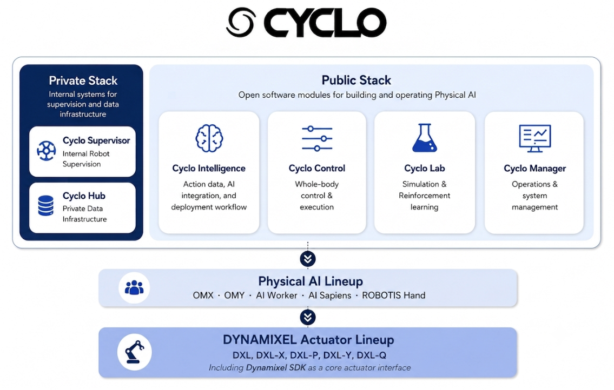

# Cyclo

<strong>A Modular Software Platform for Physical AI · ROBOTIS</strong>

  
  

Cyclo is a modular software platform for building, deploying, and operating **Physical AI** systems.

Following ROBOTIS's open-source philosophy, Cyclo provides reusable software building blocks for AI integration, action-data workflows, robot control, simulation, and system operation. These components are designed to help developers move from research and experimentation to deployment on real robotic hardware.

Cyclo is not a closed, single-vendor stack. Public open-source modules can be combined with product-specific software, third-party technologies, and optional private infrastructure such as robot supervision and proprietary data systems.

## Physical AI Lineup

* [AI Sapiens](https://github.com/ROBOTIS-GIT/ai_sapiens)
* [AI Worker](https://github.com/ROBOTIS-GIT/ai_worker)
* [OpenMANIPULATOR](https://github.com/ROBOTIS-GIT/open_manipulator)
* [ROBOTIS Hand](https://github.com/ROBOTIS-GIT/robotis_hand)

## Actuator Products

* [DYNAMIXEL](https://www.dynamixel.com/) series: DXL, DXL-X, DXL-P, DXL-Y, DXL-Q
* Interface stack: [DYNAMIXEL SDK](https://github.com/ROBOTIS-GIT/DynamixelSDK)

## Platform Overview

  

<em>Open software modules, optional private infrastructure, Physical AI robots, and DYNAMIXEL actuators.</em>

## Modules & Repositories

| Module             | Repository                                                                    | Role                                                        | Release                                                                                                                                                                |
| ------------------ | ----------------------------------------------------------------------------- | ----------------------------------------------------------- | ---------------------------------------------------------------------------------------------------------------------------------------------------------------------- |
| Cyclo Manager      | [`cyclo_manager`](https://github.com/ROBOTIS-GIT/cyclo_manager)               | System operation and management                             |                |
| Cyclo Intelligence | [`cyclo_intelligence`](https://github.com/ROBOTIS-GIT/cyclo_intelligence)     | Action-data workflows and imitation learning                |      |
| Cyclo Control      | [`cyclo_control`](https://github.com/ROBOTIS-GIT/cyclo_control)               | Robot control and whole-body execution                      |                |
| Cyclo Lab          | [`cyclo_lab`](https://github.com/ROBOTIS-GIT/cyclo_lab)                       | Simulation and reinforcement learning                       |                        |
| —                  | [`robotis_interfaces`](https://github.com/ROBOTIS-GIT/robotis_interfaces)     | Shared interface definitions                                |      |
| —                  | [`robotis_applications`](https://github.com/ROBOTIS-GIT/robotis_applications) | Application-level integrations and third-party dependencies |  |

> Additional private or product-specific repositories may be used depending on the target robot or deployment environment.

## Private Infrastructure

Cyclo can be extended with private infrastructure that is not included in the public open-source release.

Typical internal components include:

* **Cyclo Supervisor** — multi-robot supervision and task coordination
* **Cyclo Hub** — private data storage and data infrastructure

These components can operate alongside the public Cyclo modules without changing the open platform architecture.

## Quick Links

| Resource      | Description                  | Link                                                                       |
| ------------- | ---------------------------- | -------------------------------------------------------------------------- |
| Documentation | Product and software manuals | [Manual](https://docs.robotis.com/)                                        |
| Discord       | Community chat and support   | [ROBOTIS Community](https://discord.gg/robotis)                            |
| YouTube       | Tutorials and demos          | [ROBOTIS Open Source Team](https://www.youtube.com/@ROBOTISOpenSourceTeam) |

## Contributing

Contributions are welcome through issues and pull requests in the relevant Cyclo repositories.

## Star History

